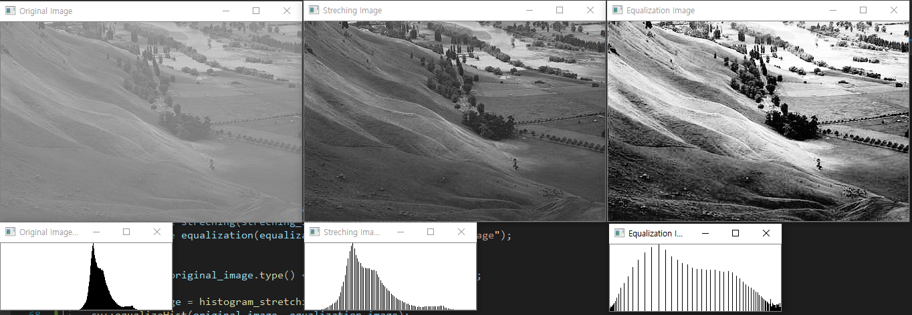

## 히스토그램

영상의 픽셀 값 분포를 그래프 형태로 나타낸 것

x축 : 픽셀 값

y축 : 해당 픽셀 값의 개수

openCV에서 기본적으로 calcHist함수를 제공해준다

```C++
void calcHist(const Mat* images, const int nimages, 
              const int* channels, InputArray mask,
              OutputArray hist, int dims, const int* histSize,
              const float** ranges, bool uniform = true, bool accumulate = false);
```
|매개변수|설명|
|---|---|
|images|입력 영상의 배열 또는 입력 영상의 주소 (여러개인 경우 모든 영상의 크기와 깊이는 같아야 한다)|
|nimages|입력 영상 개수|
|channels|히스토그램을 구할 채널을 나타내는 정수형 배열|
|mask|마스크 영상. 입력 영상과 크기가 같은 8비트 배열이여야한다.<br/>마스크 행렬의 원소가 0이 아닌 좌표의 픽셀만 히스토그램 계산에 사용<br/>Mat()또는 noArray()로 지정하면 입력 영상 전체에 대해 히스토그램을 구합니다|
|hist|출력 히스토그램. CV_32F깊이를 가진다|
|dims|출력 히스토그램의 차원 수|
|histSize|각 차원의 히스토그램 배열 크기를 나타내는 배열|
|ranges|각 차원의 히스토그램 범위. 등간격 히스토그램이면(uniform = true), ranges[i]는 각 차원의 최솟갑과 최댓값으로 구성된 배열이고 [최솟값, 최댓값) 범위를 내타닙니다. 비등간격 히스토그램이면 (uniform = false), ranges[i]는 각각의 구역을 나타내는 histSize[i]+1개의 원소로 구성된 배열입니다.|
|uniform|히스토그램 빈의 간격이 균등한지를 나타내는 플래그|
|accumulate|누적 플래스 true이면 hist 배열을 초기화하지 않고 누적하여 히스토그램을 계산한다.|

*영상에서의 깊이는 한 원소의 값이 어떤 타입인지를 말한다. CV_8UC1이면 8bit unsigned이며 채널이 1개이다.

*[a,b)는 a≤x＜b이다. (대괄호는 포함, 소괄호는 포함하지 않음)


히스토그램 평활화

영상 픽셀 값 분포를 전체 영역에서 골골 나타나게 하는 것으로 히스토그램 스트레칭과 같은 목표를 한다. 

히스토그램 스트레칭은 영상 픽셀 값 간의 간격을 동일하게 하고 최솟값과 최댓값을 각각 0과 255를 가지게 하는 방식으로 해당목표에 도달한다. 

이에 반에 히스토그램 평활화는 각 픽셀 값의 범위가 모두 비슷한 개수의 픽셀을 가지도록 하여 목표에 도달한다. 즉 이를 그림으로 표현하면 다음과 같다.



왼쪽에서부터 원본, 히스토그램 스트레칭, 히스토그램 평활화를 한 것이다.

히스토그램을 보면 할 수 있듯 원본이 특정 값에 몰려있는데 이를 스트레칭에서는 같은 간격으로 재배치하고 평활화는 크기에 반비례하여 간격을 조절한다.


$$

$$


